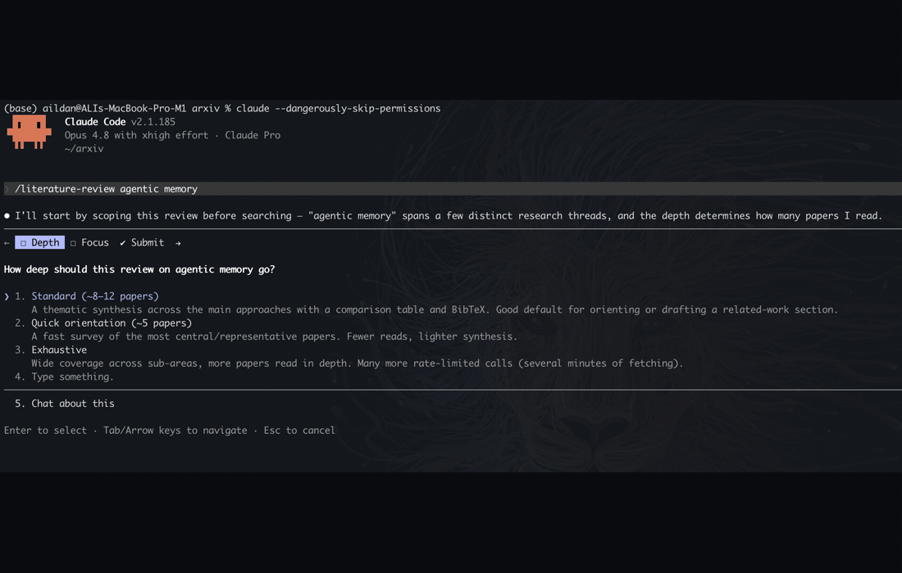
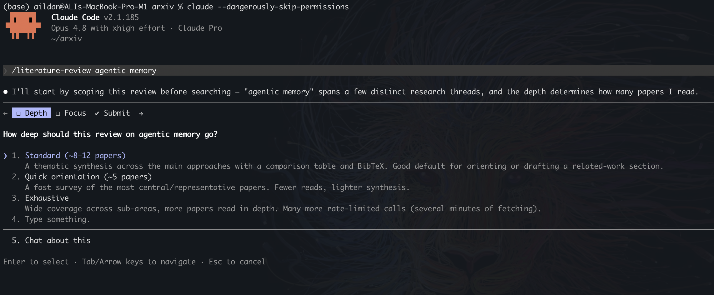
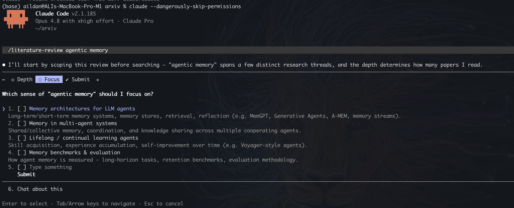
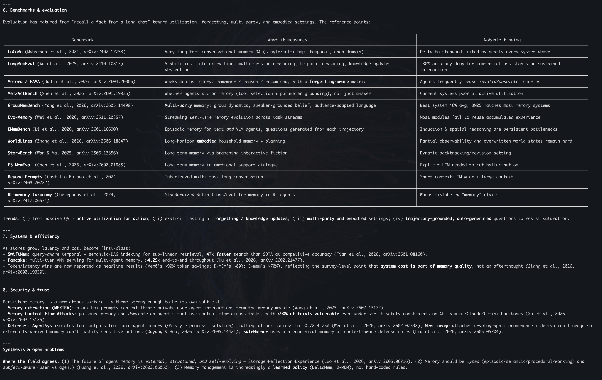

<div align="center">

# arxiv-toolkit

### Search arXiv, read papers as clean Markdown, and run cited literature reviews — straight from your terminal or any MCP client.

[](https://www.npmjs.com/package/arxiv-toolkit)
[](https://www.npmjs.com/package/arxiv-toolkit)
[](https://nodejs.org)
[](https://modelcontextprotocol.io)
[](./LICENSE)

<a href="assets/literature-review-demo.gif"></a>

<sub><b>The bundled <code>literature-review</code> skill in action</b> — scope → search → read → synthesize → cite, end to end.</sub>

</div>

---

**arxiv-toolkit** is one ESM package that ships two ways to reach arXiv's official endpoints:

- the **`arxiv` CLI** for humans and scripts, and
- the **`arxiv-mcp` server** so any [MCP](https://modelcontextprotocol.io) client (Claude Code, Claude Desktop, …) can search, read, and cite papers as tools.

API-first, polite by default, no browser required. Papers come back as **section-aware Markdown** (native HTML → ar5iv → PDF fallback) that's built to be read by an LLM within a context budget.

## Why arxiv-toolkit

|  |  |
|---|---|
| 🔎 **Search & discover** | Full-text and field-scoped search (title, author, abstract, category), boolean queries, sorting, pagination, and a "recent in a category" feed. |
| 📄 **Read full text** | Section-aware Markdown or plain text, chunkable via `maxChars`/`cursor` so a model can walk a long paper section by section. |
| 📚 **Metadata & BibTeX** | Rich metadata for one or many IDs, plus canonical BibTeX from arXiv (with an offline `@misc` fallback). |
| 🤖 **MCP-native** | The same core exposed as five MCP tools — drop it into Claude Code and ask for a review. |
| 🧠 **Literature-review skill** | A bundled Agent Skill that turns "review the literature on X" into a scoped, thematic, cited synthesis. |
| 🪶 **Polite & portable** | Per-host rate limiting, retry/backoff, aggressive caching, OS-native paths. No browser dependency. |

## Quick start

```bash
# one-off, no install
npx -y --package arxiv-toolkit arxiv search "speculative decoding" --max 10

# or install globally — both bins land on PATH
npm install -g arxiv-toolkit
arxiv read 2310.06825 --section "Method"
arxiv get 2310.06825 --bibtex
```

Wire it into Claude Code as an MCP server and ask in natural language:

```bash
claude mcp add arxiv --scope user -- npx -y --package arxiv-toolkit arxiv-mcp
```

> *"Give me a literature review of speculative decoding for LLMs."*

---

## Literature reviews, end to end

The repo ships an [Agent Skill](https://agentskills.io) — **`literature-review`** — that teaches Claude to do a focused, cited review on top of the MCP tools: **scope** the topic (depth + sub-areas), **search** (narrowing large result sets instead of deep-paging), **read** the key papers in chunks to respect the context budget, **synthesize by theme**, and **emit a BibTeX bibliography**.

It starts by scoping the work with you, so it reads the *right* papers instead of burning dozens of calls:

<table>
  <tr>
    <td width="50%"></td>
    <td width="50%"></td>
  </tr>
  <tr>
    <td align="center"><sub><b>1 · Pick a depth</b> — orientation, standard, or exhaustive.</sub></td>
    <td align="center"><sub><b>2 · Pick the focus areas</b> — multi-select the threads that matter.</sub></td>
  </tr>
</table>

…then searches, triages with BibTeX, reads targeted sections, and returns a synthesis organized by theme — with a comparison table and a references block, scaled to the depth you chose:

<div align="center">
  
  <br><sub><b>3 · A thematic synthesis</b> — comparison tables, inline citations, and a BibTeX bibliography.</sub>
</div>

### Install the skill

Works with Claude Code, Claude Desktop, and the API:

```bash
# from a checkout of this repo …
cp -r skills/literature-review ~/.claude/skills/
# … or from a global npm install:
cp -r "$(npm root -g)/arxiv-toolkit/skills/literature-review" ~/.claude/skills/
```

Register the `arxiv-mcp` server ([below](#mcp-server)), then just ask. The skill lives in [`skills/literature-review/`](./skills/literature-review/) (`SKILL.md` + an arXiv query-syntax reference) — read or adapt it freely.

---

## Install

### Global

```bash
npm install -g arxiv-toolkit
```

After global install, both bins are on `PATH`:

```bash
arxiv search "transformer attention"
arxiv-mcp   # starts the stdio MCP server
```

### npx (no global install)

> **Gotcha:** the bin names (`arxiv`, `arxiv-mcp`) differ from the package name
> (`arxiv-toolkit`). `npx arxiv-toolkit ...` does **not** resolve to the bins — use
> `--package`:

```bash
npx -y --package arxiv-toolkit arxiv search "transformer attention"
npx -y --package arxiv-toolkit arxiv read 2310.06825
npx -y --package arxiv-toolkit arxiv-mcp
```

## CLI usage

```
arxiv <command> [options]

Commands:
  search [query]          Search arXiv (query optional if a field flag is given).
  get <id...>             Fetch metadata for one or more IDs.
  read <id>               Read a paper as Markdown/text.
  download <id...>        Save PDF(s) to disk.
  recent <category>       Latest papers in a category.
  cache <clear|path>      Cache maintenance.

Global options:
  --json              JSON output (scripting)
  --no-cache          Bypass cache
  --cache-dir <dir>   Override cache directory
  --browser           Enable browser fallback (off by default)
  --quiet             Suppress hints/non-fatal warnings
  --verbose           Print stack traces on error
```

### search

```bash
arxiv search "diffusion models" --author "ho" --category cs.LG --sort submitted --max 20 --json
```

Flags: `--author --category --title --abstract --sort relevance|submitted|updated --order asc|desc --max <n> --start <n> --json`. For large result sets (>1000), a narrowing hint is printed to stderr (suppressed by `--quiet`).

### get (metadata + BibTeX)

```bash
arxiv get 2310.06825 cond-mat/0011267
arxiv get 2310.06825 --bibtex --json
```

`get` accepts multiple IDs; the metadata is batched (≤50 IDs per request) and returned in input order. `--bibtex` emits canonical BibTeX from arXiv's `https://arxiv.org/bibtex/{id}` endpoint, falling back to a generated `@misc` entry offline.

### read (full text)

```bash
arxiv read 2310.06825
arxiv read 2310.06825 --format text --section "Method"
arxiv read 2310.06825 --source pdf --max-chars 12000 --out paper.md
```

Flags: `--source auto|html|pdf` (default `auto`: native HTML → ar5iv → PDF), `--format markdown|text` (default `markdown`), `--section <name>` (return one section by `S1`-style id or title substring), `--max-chars <n>` (soft chunk target; snaps to whole-section boundaries), `--out <file>`. Use `--max-chars` to read a paper section-by-section; the `nextCursor` field in `--json` output is the authoritative "more remains" signal.

### download

```bash
arxiv download 2310.06825 cond-mat/0011267 --out ./papers
```

`download <id...>` saves each PDF (old-style IDs are sanitized on disk: `cond-mat/0011267` → `cond-mat_0011267.pdf`). The absolute saved path is printed per ID; processing continues on error and the process exits non-zero if any ID failed.

### recent

```bash
arxiv recent cs.CL --max 10 --json
```

### cache

```bash
arxiv cache clear   # empty the cache
arxiv cache path    # print the cache directory
```

## MCP server

`arxiv-mcp` is a [Model Context Protocol](https://modelcontextprotocol.io) stdio server exposing the same core as five tools: `arxiv_search`, `arxiv_get_metadata`, `arxiv_read_paper`, `arxiv_list_recent`, `arxiv_download`.

### Claude Code

Register the server for your user scope:

```bash
claude mcp add arxiv --scope user -- npx -y --package arxiv-toolkit arxiv-mcp
```

Options go **before** the name and `--` goes **before** the command. The registered server name `arxiv` and the bin `arxiv-mcp` are intentionally distinct (logical name vs. launcher). Verify with `claude mcp list`.

### Config-file forms

Equivalent static config for `.mcp.json` (Claude Code) or `claude_desktop_config.json` (Claude Desktop):

```jsonc
{
  "mcpServers": {
    "arxiv": {
      "command": "npx",
      "args": ["-y", "--package", "arxiv-toolkit", "arxiv-mcp"]
    }
  }
}
```

With a global install, use the bin directly:

```jsonc
{
  "mcpServers": {
    "arxiv": {
      "command": "arxiv-mcp"
    }
  }
}
```

### Tools

| Tool | Purpose |
|---|---|
| `arxiv_search` | Search arXiv; returns `{total,start,count,papers[],hints[]}` + text summary. |
| `arxiv_get_metadata` | Metadata for one or more IDs; optional BibTeX. |
| `arxiv_read_paper` | Section-aware Markdown/text with `nextCursor` for chunked reads. |
| `arxiv_list_recent` | Recent papers in a category. |
| `arxiv_download` | Save a PDF; returns the absolute path + a `file://` resource link. |

## Browser fallback (off by default)

The API-first path (official arXiv endpoints) is the default and needs no browser. An
optional browser fallback (`playwright-core`, lazy-loaded) can retry the **same** URLs when
the API path fails for a **non-content** reason (e.g. a challenge/`403`, or repeated
`5xx`/connection/TLS failure after retries are exhausted). It is **not** triggered by a
clean `404` (a legitimate "not available here" → the source matrix continues to the next
source).

`playwright-core` is an **optional peer dependency** — it is **not** installed by default,
so the standard install stays lean. To use the fallback, install it yourself plus a
browser binary:

```bash
npm i -g playwright-core   # or add it to your project
npx playwright install chromium
```

Then enable the fallback with any of:

- the `--browser` CLI flag,
- the `ARXIV_BROWSER=1` environment variable, or
- `"browserFallback": true` in the config file.

If `playwright-core` or a browser binary is missing when the fallback is engaged,
`arxiv-toolkit` raises a clear `UnsupportedError` with install guidance and **leaves the
API path unaffected** — it never breaks the default flow. Cache maintenance is CLI/ops-only;
there is no MCP cache tool.

## Configuration

Configuration is resolved with precedence: CLI flag → environment variable → config file → default. The config file is `<configDir>/config.json` (a `Partial<ArxivConfig>` JSON object; unknown keys are ignored).

| Env var | Field | Notes |
|---|---|---|
| `ARXIV_CACHE_DIR` | `cacheDir` | Cache directory. |
| `ARXIV_DOWNLOADS_DIR` | `downloadsDir` | Default `<data>/papers`. |
| `ARXIV_RATE_MS` | `rateMs` | Per-host min-interval (default 3000). |
| `ARXIV_MAX_RESULTS` | `defaultMaxResults` | Default page size (default 25; the 2000 clamp is fixed). |
| `ARXIV_NO_CACHE` | `noCache` | `1`/`true`/`yes` to bypass. |
| `ARXIV_BROWSER` | `browserFallback` | `1`/`true`/`yes` to enable. |
| `ARXIV_CONTACT` | `contact` | Email used in the User-Agent. |
| `ARXIV_USER_AGENT` | `userAgent` | Overrides the entire UA string. |

Paths are cross-platform via `env-paths`. A descriptive `User-Agent` with a contact email
is sent on every request; please set `ARXIV_CONTACT` to your email so arXiv can reach you
if your usage causes problems.

## Bulk access (out of scope)

This toolkit is for targeted search and reading, not bulk harvesting. For large-scale
access use arXiv's official bulk channels:

- **OAI-PMH** — `https://oaipmh.arxiv.org/oai`
- **AWS S3 (requester-pays)** — `s3://arxiv` (`pdf/`, `src/` + manifests). See [arXiv S3 bulk data](https://info.arxiv.org/help/bulk_data_s3.html).
- **Kaggle** — [Cornell University/arxiv](https://www.kaggle.com/datasets/Cornell-University/arxiv) dump.

See [arXiv bulk data](https://info.arxiv.org/help/bulk_data.html) for guidance and etiquette.

## License

MIT. See [LICENSE](./LICENSE).
